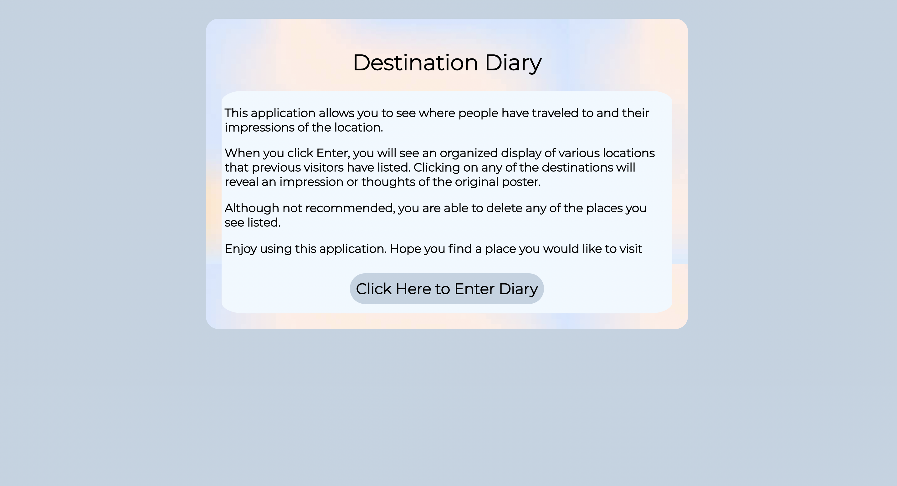
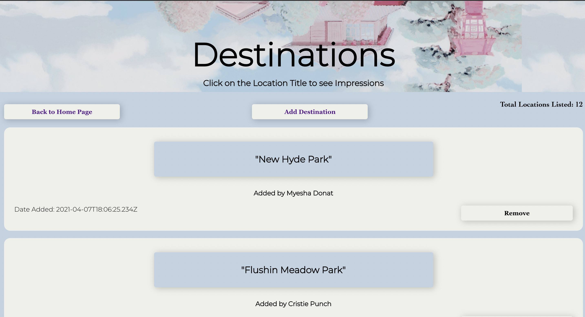
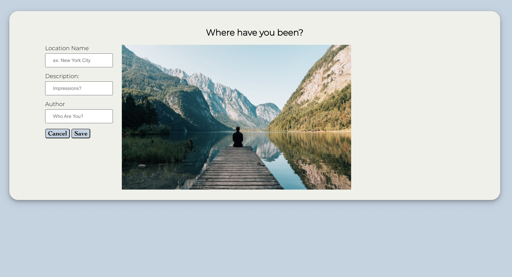

# Travel Server

Live Application: [https://travel-client.vercel.app/](https://travel-client.vercel.app/) 

Client Repo: [https://github.com/Nishat322/travel-client](https://github.com/Nishat322/travel-client)  

## User Story
Destination Diary allows users to catalog their travelling experience in one cohesive place. Users can use the application by clicking enter diary. Which leads them to a list of locations listed by previous visitors to the website. Users can add a location by clicking on the add location button. Users are also able to delete any location from the list by clicking on the remove button.

## API Documentation

### Travel Endpoints 

## /api/travel
     GET: Return an array of locations
     POST: Add a location to the list

## /api/travel/:destination_id
     GET: Return a location
     DELETE: Delete the location from the array
    
### Landing Page

### Travel Page

### Add Travel Page

## Tech Stack
### Backend

- RESTful API
- Node & Express
- Knex
- Supertest
- Mocha & Chai
- Deployed Heroku